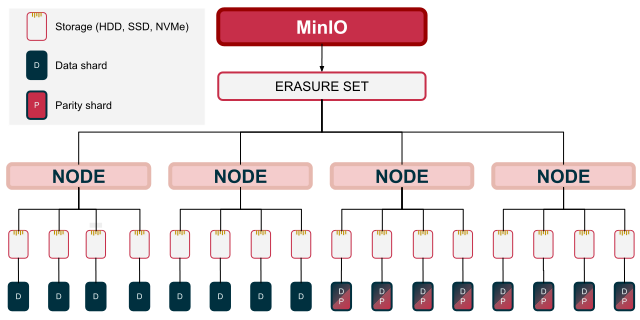

# «Bob vs MinIO» Comparison

## Benchmarks

### Context

1. When measuring the performance of «MinIO», a large difference was noticed between the median and mean values.
   The specified values are given taking into account the rejection of the extreme values
2. For «Bob», the average value is taken - the deviation of the average from the median ~1%
3. Protobufs were used for requests to Bob, and the Rust SDK was used for requests to «MinIO»
4. Methodology: https://bheisler.github.io/criterion.rs/book/analysis.html
5. A more detailed benchmark report: https://html-preview.github.io/?url=https://github.com/qoollo/bob-benchmarks/blob/main/criterion/report/index.html

### Read time (MinIO: mean time)

| DB/Node Count/Size   | Time per Request, ns. | RPS     |  Throughput  |
| :------------------- | :-------------------- | :------ | :----------: |
| Bob/1 Node/1 KB      | 527,50                | 1895,73 | 1.8513 MiB/s |
| Bob/2 Nodes/1 KB     | 245,55                | 4072,49 | 3.9770 MiB/s |
| Bob/1 Node/50 KB     | 796,88                | 1254,89 | 61.274 MiB/s |
| Bob/2 Nodes/50 KB    | 610,18                | 1638,86 | 80.022 MiB/s |
| Bob/1 Node/1 MB      | 10405                 | 96,11   | 96.104 MiB/s |
| Bob/2 Nodes/1 MB     | 9113,4                | 109,72  | 109.73 MiB/s |
| Bob/1 Node/100 MB    | 939050                | 1,065   | 106.49 MiB/s |
| Bob/2 Nodes/100 MB   | 972280                | 1,028   | 102.85 MiB/s |
| Minio/1 Node/1 KB    | 1299,2                | 769,71  | 769.69 KiB/s |
| Minio/2 Nodes/1 KB   | 2036,1                | 491,13  | 491.12 KiB/s |
| Minio/1 Node/50 KB   | 2019,0                | 495,29  | 24.184 MiB/s |
| Minio/2 Nodes/50 KB  | 2421,9                | 412,89  | 20.161 MiB/s |
| Minio/1 Node/1 MB    | 7895,0                | 126,66  | 126.66 MiB/s |
| Minio/2 Nodes/1 MB   | 9059,8                | 110,38  | 110.38 MiB/s |
| Minio/1 Node/100 MB  | 464000                | 2,155   | 215.52 MiB/s |
| Minio/2 Nodes/100 MB | 476670                | 2,097   | 209.79 MiB/s |

### Write time (MinIO: mean time)

| DB/Node Count/Size   | Time per Request, ns. | RPS     |  Throughput  |
| :------------------- | :-------------------- | :------ | :----------: |
| Bob/1 Node/1 KB      | 336,79                | 2969,21 | 2.8996 MiB/s |
| Bob/2 Nodes/1 KB     | 739,81                | 1351,69 | 1.3200 MiB/s |
| Bob/1 Node/50 KB     | 620,6                 | 1611,34 | 78.679 MiB/s |
| Bob/2 Nodes/50 KB    | 1328,8                | 752,55  | 36.746 MiB/s |
| Bob/1 Node/1 MB      | 7926,6                | 126,15  | 126.16 MiB/s |
| Bob/2 Nodes/1 MB     | 17402                 | 57,46   | 57.464 MiB/s |
| Bob/1 Node/100 MB    | 1048700               | 0,95    | 95.356 MiB/s |
| Bob/2 Nodes/100 MB   | 2256600               | 0,44    | 44.314 MiB/s |
| Minio/1 Node/1 KB    | 1895,1                | 527,677 | 0.5277 MiB/s |
| Minio/2 Nodes/1 KB   | 4278,7                | 318,89  | 0.3189 MiB/s |
| Minio/1 Node/50 KB   | 4278,7                | 233,71  | 11.412 MiB/s |
| Minio/2 Nodes/50 KB  | 6082,8                | 164,39  | 8.0273 MiB/s |
| Minio/1 Node/1 MB    | 35422                 | 28,23   | 28.231 MiB/s |
| Minio/2 Nodes/1 MB   | 35340                 | 28,29   | 28.297 MiB/s |
| Minio/1 Node/100 MB  | 2622100               | 0,38    | 38.138 MiB/s |
| Minio/2 Nodes/100 MB | 3465900               | 0,29    | 28.852 MiB/s |

### Write time (MinIO: median time)

| DB/Node Count/Size   | Time per Request, ns. | RPS     |  Throughput  |
| :------------------- | :-------------------- | :------ | :----------: |
| Bob/1 Node/1 KB      | 336,79                | 2969,21 | 2.8996 MiB/s |
| Bob/2 Nodes/1 KB     | 739,81                | 1351,69 | 1.3200 MiB/s |
| Bob/1 Node/50 KB     | 620,6                 | 1611,34 | 78.679 MiB/s |
| Bob/2 Nodes/50 KB    | 1328,8                | 752,55  | 36.746 MiB/s |
| Bob/1 Node/1 MB      | 7926,6                | 126,15  | 126.16 MiB/s |
| Bob/2 Nodes/1 MB     | 17402                 | 57,46   | 57.464 MiB/s |
| Bob/1 Node/100 MB    | 1048700               | 0,95    | 95.356 MiB/s |
| Bob/2 Nodes/100 MB   | 2256600               | 0,44    | 44.314 MiB/s |
| Minio/1 Node/1 KB    | 1837,6                | 544,18  | 0,5442 MiB/s |
| Minio/2 Nodes/1 KB   | 3069,7                | 325,76  | 0,3257 MiB/s |
| Minio/1 Node/50 KB   | 3524,5                | 283,72  | 14,186 MiB/s |
| Minio/2 Nodes/50 KB  | 4713,6                | 212,15  | 10,608 MiB/s |
| Minio/1 Node/1 MB    | 23348                 | 42,83   | 42,830 MiB/s |
| Minio/2 Nodes/1 MB   | 25448                 | 39,29   | 39,295 MiB/s |
| Minio/1 Node/100 MB  | 2499600               | 0,40    | 40,006 MiB/s |
| Minio/2 Nodes/100 MB | 3303800               | 0,31    | 30,268 MiB/s |

### Conclusion

1. Bob's RPS on write operations is always greater than that of MinIO
2. MinIO is faster on read operations with large object size, 100 MB for instance. At the same time, Bob wins when reading objects with their size lesser or equal 1 MB.
3. Regarding MinIO, it's observed that the average request time is very different from the median, about ~7-10% of requests are significantly worse than the rest (the rejection of too serious deviations was taken into account).
   With the same benchmark configuration, Bob doesn't have such a problem

### Fault Tolerance

### Minio: Erasure Coding

MinIO groups disks in each server pool into one or more Erasure sets of the same size.
For each write operation, MinIO splits the object into Data and Parity segments; the maximum number of Parity segments is half of the total number.
To maintain a quorum on read operations, it's necessary to maintain the number of segments equal to the number of data segments (when dividing 8/8, 8 segments must be maintained, 12 segments for 12/4, etc.).
To maintain a quorum on write, the same rule applies except for the 8/8 split; in this case, you need to maintain at least 9 segments.

So, for example, on 4 nodes configuration, the cluster can lose up to two nodes
Among other things, for the fault tolerance of the system, there is bucket replication between nodes and replication of the nodes themselves (2 replicating nodes and a load balancer are installed, sending data to the desired node).
These approaches haven't been tested.

### Bob: Fault tolerance

All data is logically distributed across virtual disks.
The cluster writes data to all nodes containing the target virtual disk.
The cluster continues to write as long as at least one node exists, but it loses consistency after 2 nodes are disconnected (with 4 nodes and a replication factor of 2).

## Feature Comparison

### Pros

#### Bob

1. Faster write operations on data of any size and reading of small sized objects.
2. Protobuf implementation, thus the ability to generate a client based on .proto schema
3. The ability to withstand the failure of all nodes in the cluster (except the last one) - Full data replication

#### MinIO

1. Faster reading of data larger than 100 MB.
2. SDK for most popular programming languages.
3. MinIO is able to clear data from the database when deleting objects.
4. More efficient use of disk resources due to Erasure Coding

### Cons

#### Bob

1. Unable to automatically clear the data on disk when deleting objects. As a result, less optimal consumption of disk space.
2. S3 API is missing.
3. Non-uniform use of network resources (spikes).

#### MinIO

1. Unlike Bob, MinIO can withstand a drop to a maximum of N/2 drives/nodes with the number of N drives/nodes (depends on configuration).
2. Higher RAM utilization (compared to Bob).
3. Incomplete implementation of the S3 API
