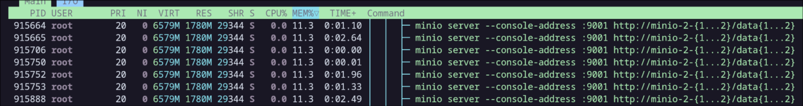
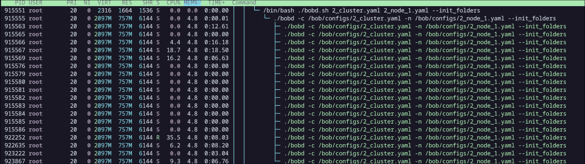
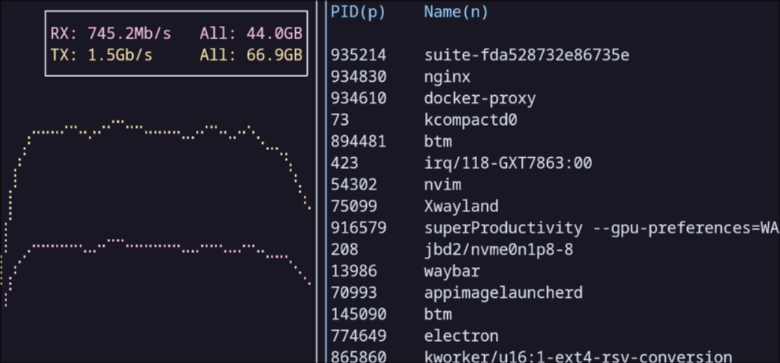
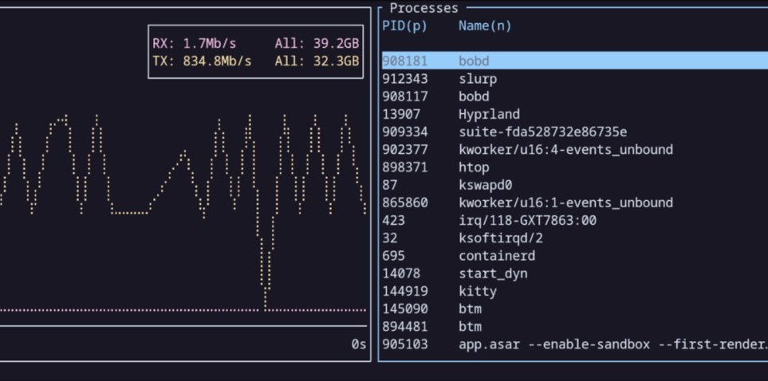

# «Bob vs Minio» 

---

# Касательно замеров
1. При замерах производительности Minio была замечена большая разница между показателями медианы и среднего. Указанные значения приведены С УЧЕТОМ отбраковки крайних значений
2. Для Боба всегда бралось среднее значение (у Боба при всех замерах отклонение среднего от медианного ~1%)
3. Для запросов к Бобу использовались protobuf'ы, Для запросов к minio - sdk на Rust 
4. Аналитический процесс бенчмарков -> https://bheisler.github.io/criterion.rs/book/analysis.html
5. Более подробный отчет TODO

---

# <header> «Время чтения (по среднему запросу Minio)» </header> 

| БД/Кол-во Нод/Размер          | Время на запрос, нс     | RPS          | Пропускная способность    |
| :------------- | :-------------------- | :------------ | :------------: |
| Bob/1 Нода/1KB     | 520,45              | 1921,41  | 1.8513 MiB/s |
| Bob/2 Ноды/1KB     | 239,32               | 4178,50  | 3.9770 MiB/s |
| Bob/1 Нода/50KB    | 777,41               | 1286,32  | 61.274 MiB/s |
| Bob/2 Ноды/50KB     | 607,4                | 1646,36  | 80.022 MiB/s |
| Bob/1 Нода/1MB     | 8106,4               | 123,35   | 122.34 MiB/s |
| Bob/2 Ноды/MB     | 8701,7               | 114,92  | 115.13 MiB/s |
| Bob/1 Нода/100MB   | 1032100              | 0,96 | 96.837 MiB/s |
| Bob/2 Ноды/100MB   | 1059900              | 0,94 | 95.076 MiB/s |
| Minio/1 Нода/1KB   | 1251,3               | 799,16  | 787.35 KiB/s |
| Minio/2 Ноды/1KB   | 1987,5               | 503,14  | 498.94 KiB/s |
| Minio/1 Нода/50KB  | 1914,2               | 522,41  | 20.991 MiB/s |
| Minio/2 Ноды/50KB  | 2004,2               | 498,95  | 20.243 MiB/s |
| Minio/1 Нода/1MB   | 8799,1               | 113,64  | 113.65 MiB/s |
| Minio/2 Ноды/1MB   | 9104,6               | 109,83  | 109.83 MiB/s |
| Minio/1 Нода/100MB | 473470               | 2,11  | 211.21 MiB/s |
| Minio/2 Ноды/100MB | 480820               | 2,07  | 207.98 MiB/s |

---

# <header> «Время записи (по среднему времени запроса Minio)» </header> 

| БД/Кол-во Нод/Размер          | Время на запрос, нс     | RPS          | Пропускная способность    |
| :------------- | :-------- | :------------ | :------------: |
| Bob/1 Нода/1KB     | 279,21   | 3581,533613  | 3.5600 MiB/s |
| Bob/2 Ноды/1KB     | 636,36   | 1571,437551  | 1.5240 MiB/s |
| Bob/1 Нода/50KB    | 670,77   | 1490,823978  | 72.079 MiB/s |
| Bob/2 Ноды/50KB    | 1309,6   | 763,5919365  | 36.977 MiB/s |
| Bob/1 Нода/1MB     | 7009,4   | 142,6655634  | 142.67 MiB/s |
| Bob/2 Ноды/1MB     | 15461    | 64,67886941  | 64.680 MiB/s |
| Bob/1 Нода/100MB   | 1493500  | 0,6695681286 | 66.959 MiB/s |
| Bob/2 Ноды/100MB   | 2726300  | 0,3667974911 | 36.680 MiB/s |
| Minio/1 Нода/1KB   | 3083,9 (Среднее)   | 324,2647297  | 324.26 KiB/s |
| Minio/2 Ноды/1KB   | 13295 (Среднее)    | 75,21624671  | 75.217 KiB/s |
| Minio/1 Нода/50KB  | 5809,6 (Среднее)   | 172,1288901  | 8.4048 MiB/s |
| Minio/2 Ноды/50KB  | 8057,8 (Среднее)   | 124,1033533  | 6.0598 MiB/s |
| Minio/1 Нода/1MB   | 50390 (Среднее)    | 19,84520738  | 19.845 MiB/s |
| Minio/2 Ноды/1MB   | 113440 (Среднее)   | 8,815232722  | 8.8151 MiB/s |
| Minio/1 Нода/100MB | 3017300 (Среднее)  | 0,3314221324 | 33.142 MiB/s |
| Minio/2 Ноды/100MB | 3562500 (Среднее) | 0,2807017544 | 28.071 MiB/s |

---

# <header> «Время записи (по медианному времени запроса Minio)» </header> 

| БД/Кол-во Нод/Размер          | Время на запрос, нс     | RPS          | Пропускная способность    |
| :------------- | :-------- | :------------ | :------------: |
| Bob/1 Нода/1KB     | 279,21   | 3581,53  | 3.5600 MiB/s |
| Bob/2 Ноды/1KB     | 636,36   | 1571,43  | 1.5240 MiB/s |
| Bob/1 Нода/50KB    | 670,77   | 1490,82  | 72.079 MiB/s |
| Bob/2 Ноды/50KB    | 1309,6   | 763,59  | 36.977 MiB/s |
| Bob/1 Нода/1MB     | 7009,4   | 142,66  | 142.67 MiB/s |
| Bob/2 Ноды/1MB     | 15461    | 64,67  | 64.680 MiB/s |
| Bob/1 Нода/100MB   | 1493500  | 0,66 | 66.959 MiB/s |
| Bob/2 Ноды/100MB   | 2726300  | 0,36 | 36.680 MiB/s |
| Minio/1 Нода/1KB   | 1855,4 (Медиана)  | 538,96  | 0.5389MiB/s |  |
| Minio/2 Ноды/1KB   | 3149,9 (Медиана)  | 317,47  | 0.3175MiB/s |  |
| Minio/1 Нода/50KB  | 3668,5 (Медиана)  | 272,59  | 13,629MiB/s |  |
| Minio/2 Ноды/50KB  | 4563,6 (Медиана)  | 219,12   | 10,956MiB/s  |  |
| Minio/1 Нода/1MB   | 22776 (Медиана)   | 43,90  | 43,905MiB/s |  |
| Minio/2 Ноды/1MB   | 25859 (Медиана)   | 38,67  | 38,671MiB/s |  |
| Minio/1 Нода/100MB | 2867000 (Медиана) | 0,35 | 34,879MiB/s |  |
| Minio/2 Ноды/100MB | 3240300 (Медиана) | 0,31    | 30,861MiB/s |  |

---

# <header> «Выводы» </header>
1. RPS Боба при записи всегда больше, чем у Minio
2. Minio Быстрее в чтении данных большого размера, 100 Мб. Боб при этом выигрывает при чтении данных малого размера.
3. По какой-то причине, у Minio среднее время запроса сильно отличается от медианной, порядка ~7-10% запросов *значительно* хуже остальных (отброс слишком серьезных отклонений учитывался). При той же конфигурации бенчмарка, у боба такой проблемы не наблюдается
4. Предположение: Значительное ухудшение в производительности у Боба скорее всего настигает при достижении размера объекта 4Мб. Возможно gRPC'шный клиент не способен адекватно обработать запросы такого размера. (Нужна отдельная проверка)

---

# <header> Minio: Erasure Coding </header>

---

# <header> MinIO: Erasure Coding </header>

MinIO группирует диски в каждом пуле серверов в один или несколько Erasure сетов одинакового размера. Для каждой операции записи MinIO разбивает объект на сегменты данных (Data) и четности (Parity); Макс. кол-во Parity сегментов - половина от общего числа. Для сохранения кворума на чтение необходимо сохранить количество сегментов равных количеству сегментов данных (при разделении 8/8 необходимо сохранить 8 сегментов, при 12/4 необходимо 12 сегментов). Для записи тоже самое за исключением 8/8 разделения. В данном случае необходимо сохранить 9 сегментов.

---

# <header> MinIO: Fault tolerance </header>

Так, например, при сборке в 4 ноды, кластер может потерять до двух нод

Помимо прочего для отказоустойчивость системы есть репликация бакетов между нодами и реплекация самих нод (ставятся 2 реплицирующие ноды и балансировщик, отправляющий данные в нужную ноду)

Тестирование данных одходов не проводилось

---

# <header> Bob: Fault tolerance </header>

Все данные логически распределены по виртуальным дискам. Кластер записывает данные на все узлы, содержащие целевой виртуальный диск. Таким образом идет полная репликация данных, что придает системе устойчивость к падению всех нод, кроме последней

Так, например, при сборке в 4 ноды, кластер может потерять до трех нод

---

# <header> Преимущества </header>

    

        Bob
        <ul style="list-style-type: '+ '">
            <li> Более быстрая запись данных любого размера и чтение небольшого размера
            <li> Возможность генерировать клиент на основе .proto схемы + Protobuf'ы
            <li> Способен выдерживать падение всех нод в кластере (кроме последнего) - Полная репликация данных
        </lu>
    

    

        Minio
        <ul style="list-style-type: '+ '">
            <li> Более быстрое чтение данных размеров >=100МБ 
            <li> Есть SDK для популярных языков программирования
            <li> Умеет очищать данные из базы данных при удалении объектов
            <li> Более эффективное использование дисковых ресурсов за счет Erasure Coding'а
        </lu>
    

---

# <header> Недостатки </header>

    

        Bob
        <ul style="list-style-type: '- '">
            <li> Не умеет  автоматически очищать хранилище данных при удалении объектов. Как следствие менее оптимальный расход дискового пространства и может вызвать головную боль
            <li> Отстутствует S3 API
            <li> Неравномерно использование сетевых ресурсов (спайки)
        </lu>
    

    

        Minio
        <ul style="list-style-type: '- '">
            <li> В отличии от Боба, может выдержать падение максимум до N/2 приводов/нод при количестве N приводов/нод (зависит от кофигурации) 
            <li> Более высокая утилизация RAM (по сравнению с Bob)
            <li> Неполная имплементация S3 API
        </lu>
    

---

# <header> Minio: Касательно удаления данных... </header>
 
Удаление данных с диска у Minio при удаленни объекта из БД - при однокластерном решении, он это делает всегда (помещается в отдельную директорию `.minio.sys/tmp/.trash`), при настроенной репликации - с какой-то переиодичностью или ключевых моментах (перезапуск ноды, например); У Боба необходимо либо вручную, либо утилитами

---

# <header> RAM: Minio </header>

---

# <header> RAM: Bob </header>

---

# <header> Net: Minio </header>

---

# <header> Net: Bob </header>

---

# Неудачный эксперимент: OpenIO
В данном сравнении также должен быть участвовать OpenIO, но удачно сконифгурировать и заупстить кластер так и не вышло.
После покупки OpenIO компанией OVH (2020 год) создается ощущение фактически мертвого проекта.

--- 

# <header> Проблемы </header>
1. Последний докер образ, доступный на докерхабе, был в последний раз обновлен 3 года назад. Тот образ, что там есть если не повезет, то крашнется, а если повезет, будет висеть без возможности записи данных.
2. Очень скудная поддержка дистрибутивов: На официальной странице указана CentOS 7 и Ubuntu 18.04
3. При компиляции из исходников требуется большой набор внешних зависимостей, которые необходимо ставить руками. Проходить данный этап при необходимости запустить кластер - вещь достаточно затратная по времени.
